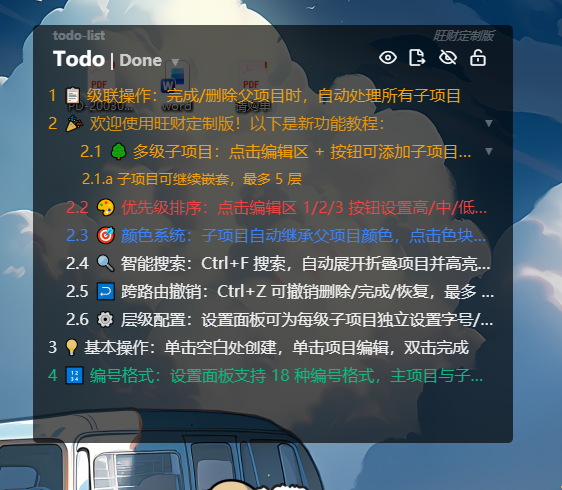
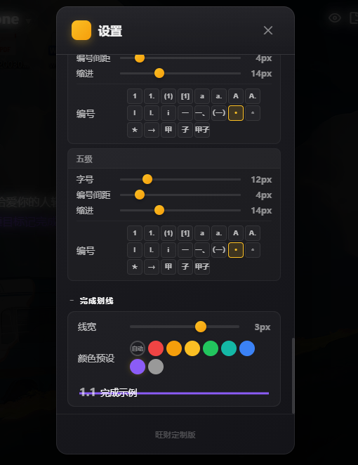
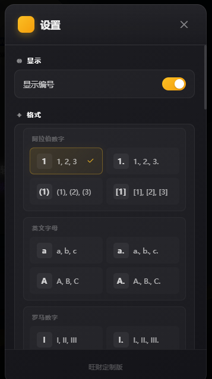

<p align="center">
  
  
  
  
</p>

<h1 align="center">todo-list · 旺财定制版</h1>

<p align="center">
  <strong>深度定制的 Electron 桌面待办应用 —— 多级子项目 · 智能搜索 · 跨路由撤销 · 层级独立配置</strong>
</p>

<p align="center">
  <sub>基于 <a href="https://github.com/xiajingren/xhznl-todo-list">xhznl-todo-list</a> by <a href="https://github.com/xiajingren">@xiajingren</a> 深度定制开发</sub>
</p>

<p align="center">
  <sub>定制开发者：<a href="https://github.com/WangCai-1227">@WangCai-1227</a></sub>
</p>
<br>

***

## 🌟 核心新功能

> 在原版基础上，我们新增了以下功能模块：

|      功能模块      | 说明                                             |
| :------------: | ---------------------------------------------- |
| 🌳 **多级子项目系统** | 无限嵌套子项目（建议 ≤5 层），支持拖拽重组、颜色继承、级联操作、层级独立配置、连续删除线 |
|   🔍 **智能搜索**  | 全文搜索 + 自动展开折叠路径 + 关键词高亮显示                      |
|  ↩️ **跨路由撤销**  | Ctrl+Z 跨 Todo/Done 页面撤销，最多 20 步历史记录            |
|  🎨 **优先级系统**  | 高/中/低三级优先级自动排序，拖拽调整即视为优先级设定                    |
|   ⚙️ **设置增强**  | 窗口标题/背景色/透明度可自定义并持久化保存；支持 Excel 导入导出（含子项目）     |

***

## 📋 目录

- [功能概览](#-功能概览)
- [截图](#-截图)
- [快速开始](#-快速开始)
- [功能详解](#-功能详解)
- [键盘快捷键](#-键盘快捷键)
- [设置项说明](#-设置项说明)
- [技术架构](#-技术架构)
- [构建部署](#-构建部署)
- [与原版差异对比](#-与原版差异对比)
- [版本更新记录](#-版本更新记录)
- [致谢](#-致谢)
- [许可协议](#-许可协议)

***

## ✨ 功能概览

### 🔥 我们的新功能

| 功能                | 说明                              |
| ----------------- | ------------------------------- |
| 🌳 **多级子项目**      | 无限嵌套子项目，支持拖拽重组到其他父项目            |
| 🔍 **智能搜索**       | 搜索时自动展开折叠路径，关键词高亮显示             |
| ↩️ **跨路由撤销**      | Ctrl+Z 跨 Todo/Done 页面撤销，最多 20 步 |
| 📋 **级联操作**       | 完成/删除/恢复父项目时，自动处理所有子项目          |
| 🎯 **颜色继承**       | 子项目自动继承父项目颜色，智能同步变色             |
| ⚙️ **层级配置**       | 每级子项目独立设置字号、间距、缩进、编号格式          |
| ✏️ **连续删除线**      | 从编号到正文的完整不间断删除线                 |
| ✏️ **标题自定义**      | 左右标题可在设置中自定义并持久化保存              |
| 🎨 **背景色与透明度**    | 窗口背景透明度与颜色可在设置中调整并持久化           |
| 🖱️ **拖拽排序优先级**   | 拖拽调整排序即视为优先级，修复一级条目拖拽bug        |
| 📊 **Excel 导入导出** | 导出包含完整子项目；支持导入自动排序              |

### 📦 基础功能（继承自原版）

| 功能                | 说明             |
| ----------------- | -------------- |
| ✅ **待办管理**        | 创建、编辑、删除、拖拽排序  |
| 🔢 **编号系统**       | 数字编号格式         |
| 🖱️ **鼠标穿透**      | 一键锁定/解锁，穿透点击   |
| 📌 **窗口置顶**       | 始终保持在最前        |
| 📊 **Excel 导出导入** | 导出/导入todo和done |

***

## 📸 截图

### Todo列表

<br />



### Done列表


### 设置面板





***

## 🚀 快速开始

### 环境要求

- Node.js 12+
- npm 6+
- Windows / macOS / Linux

### 安装与运行

```bash
# 克隆项目
git clone https://github.com/WangCai-1227/tido-list-Custom-Edition.git
cd tido-list-Custom-Edition

# 安装依赖
npm install

# 开发模式运行（热重载）
npm run electron:serve

# 生产构建
npm run electron:build
```

***

## 🧩 功能详解

### 🌳 多级子项目系统（新功能 ⭐）

**创建子项目**

- 编辑工具栏中点击 `+` 按钮添加子项目
- 新建子项目自动继承父项目颜色

**拖拽重组**

- 子项目可拖拽至其他父项目下，自动重新计算编号
- 拖拽后颜色保持不变，不重新继承新父项目颜色

**折叠/展开**

- 点击项目右侧 `▶`/`▼` 切换
- 导航栏一键展开/折叠全部
- 最多 5 层嵌套

**完成语义**

- 单独完成子项目：绘制删除线，保留在原位
- 完成父项目：级联完成所有子项目，整棵树移至 Done 页
- 删除线从编号到正文连续不间断

### 🔍 智能搜索（新功能 ⭐）

- 全文搜索 Todo 和 Done 页面
- 搜索时自动展开所有折叠的父项目
- 关键词高亮显示
- 搜索取消后恢复原始折叠状态

### ↩️ 跨路由撤销（新功能 ⭐）

- `Ctrl+Z` 跨 Todo/Done 页面撤销操作
- 最多 20 步历史记录
- 支持撤销：删除、完成、恢复操作
- 级联操作完整恢复（包含所有子项目）

### 📋 级联操作（新功能 ⭐）

**级联完成**

- 双击父项目 → 所有子项目同步标记完成 → 整棵树移至 Done 页

**级联删除**

- 删除父项目 → 所有子项目同步删除

**级联恢复**

- `Ctrl+Z` 撤销 → 完整恢复父子关系

### 🎯 智能颜色系统（新功能 ⭐）

- 新建子项目自动继承父项目颜色
- 父项目改色时，若所有子项目颜色相同，则自动同步变化
- 子项目可独立修改颜色，不影响父项目
- 完成状态保留颜色信息

### 🎨 优先级排序

- 三级优先级：高 / 中 / 低
- 自动排序：高 > 中 > 低 > 无
- 文字与编号随优先级联动变色
- 同优先级按创建时间排序

### ⚙️ 层级独立配置（新功能 ⭐）

设置面板支持为每级子项目独立配置：

- **字号**：该级子项目字体大小
- **编号间距**：编号与正文间距
- **缩进**：行左缩进（多级累加）
- **编号格式**：18 种格式任选

### 编号系统

支持 **18 种编号格式**，分为 6 组：

| 分组    | 格式                   |
| ----- | -------------------- |
| 阿拉伯数字 | `1` `1.` `(1)` `[1]` |
| 英文字母  | `a` `a.` `A` `A.`    |
| 罗马数字  | `I` `I.` `i`         |
| 中文数字  | `一` `一、` `（一）`       |
| 符号标记  | `•` `◦` `★` `→`      |
| 天干地支  | `甲` `子` `甲子`         |

> 主项目与每级子项目可分别设置独立的编号格式。

### 待办管理

- **创建**：点击列表空白区域，输入内容后回车
- **编辑**：单击项目进入编辑模式
- **完成**：双击项目标记完成（移至 Done 页）
- **删除**：编辑模式下点击 ✕ 按钮
- **排序**：拖拽项目调整顺序

### 已完成管理

- **自动归档**：完成事项自动归档至 Done 页
- **恢复**：点击 `↩` 按钮恢复至待办列表
- **子项目显示**：已完成事项的子树结构完整保留

### 导出与导入

**导出**

- **格式**：`.xlsx`（Excel）
- **数据范围**：Todo 列表和 Done 列表分别导出
- **包含字段**：序号、内容、优先级、颜色、创建时间、完成时间
- **子项目**：递归完整导出，层级编号，内容缩进，不再折叠
- **操作方式**：点击导出按钮弹出菜单，选择导出 Todo 或 Done

**导入**

- **格式**：仅支持本工具导出的 `.xlsx` 格式
- **自动排序**：导入的条目根据优先级（高 > 中 > 低 > 无）和创建时间自动排序
- **子项目还原**：完整还原父子层级关系
- **异常处理**：格式不符时弹出错误提示，不会导致应用卡死

***

## ⌨️ 键盘快捷键

| 快捷键            | 功能          |
| -------------- | ----------- |
| `Ctrl+F`       | 🔍 搜索（自动展开） |
| `Ctrl+Z`       | ↩️ 撤销（跨路由）  |
| `Esc`          | 关闭搜索 / 取消编辑 |
| `Ctrl+↓`       | 展开第一个折叠项目   |
| `Ctrl+↑`       | 折叠第一个展开项目   |
| `Ctrl+Shift+↓` | 展开全部        |
| `Ctrl+Shift+↑` | 折叠全部        |


***

## 🏗️ 技术架构

```
┌─────────────────────────────────────┐
│           Electron 主进程           │
│  background.js + backgroundExtra.js │
│  - 窗口管理 / 托盘                  │
│  - 数据导出 (ExcelJS)              │
│  - IPC 通信桥                      │
└────────────────┬────────────────────┘
                 │ IPC
┌────────────────▼────────────────────┐
│          Vue 渲染进程               │
│  Vue 2.6 + Vue Router 3            │
│                                    │
│  ┌──────────┐  ┌──────────┐       │
│  │ Todo.vue │  │ Done.vue │       │
│  └────┬─────┘  └────┬─────┘       │
│       │              │              │
│  ┌────▼──────────────▼─────┐       │
│  │      App.vue (设置)     │       │
│  └────────────┬────────────┘       │
│               │                     │
│         ┌─────▼──────┐             │
│         │  EventBus  │ ←跨路由通信  │
│         └─────┬──────┘             │
└────────────────┬────────────────────┘
                 │
┌────────────────▼────────────────────┐
│           数据层                   │
│  lowdb 1.0 + lodash-id             │
│  userData/data.json                │
│  migrateData 幂等迁移              │
│  撤销栈 (最多20步)                  │
└─────────────────────────────────────┘
```

### 核心技术栈

| 技术                    | 版本   | 用途              |
| --------------------- | ---- | --------------- |
| Electron              | 11.x | 桌面应用框架          |
| Vue                   | 2.6  | 渲染进程 UI         |
| Vue Router            | 3.x  | 路由（Todo / Done） |
| lowdb                 | 1.0  | JSON 文件数据库      |
| vuedraggable          | 2.x  | 拖拽排序            |
| exceljs               | 4.x  | Excel 导出        |
| dayjs                 | 1.x  | 日期处理            |
| lodash-id             | 0.14 | UUID 生成         |
| electron-window-state | 5.x  | 窗口状态持久化         |

***

## 📦 构建部署

```bash
# 构建当前平台安装包
npm run electron:build

# 构建输出目录
dist_electron/
├── todo-list Setup x.x.x.exe  # Windows 安装包
├── todo-list-x.x.x-mac.zip     # macOS 安装包
└── todo-list-x.x.x.AppImage    # Linux AppImage
```

### 数据文件位置

| 环境 | 数据文件路径                     |
| -- | -------------------------- |
| 开发 | `{userData}/data-dev.json` |
| 生产 | `{userData}/data.json`     |

> Windows 下 `userData` 通常为 `%APPDATA%/todo-list`

## 🙏 致谢

感谢 [xiajingren](https://github.com/xiajingren) 创建了优秀的 [xhznl-todo-list](https://github.com/xiajingren/xhznl-todo-list) 项目，本项目在此基础上进行拓展开发。

***

## 📄 许可协议

本项目继承原项目的开源许可协议。

- 原版项目：[xhznl-todo-list](https://github.com/xiajingren/xhznl-todo-list) by [xiajingren](https://github.com/xiajingren)
- 定制版本：[todo-list · 旺财定制版](https://github.com/WangCai-1227/tido-list-Custom-Edition) by [Wangcai-1227](https://github.com/WangCai-1227)

***

<p align="center">
  <sub>Built with ❤️ by <a href="https://github.com/WangCai-1227">WangCai-1227</a> · Based on <a href="https://github.com/xiajingren/xhznl-todo-list">xhznl-todo-list</a></sub>
</p>

***

## 📜 版本更新记录

### v1.1.1（当前版本）

> 基于 v1.1.0 迭代更新

- 🔧 修复 Ctrl+Z 无法撤回子项目完成的 bug，并加入支持多种操作
- 🔧   实装了子项目优先级与用户拖拽排序无效的bug
- ✨ 优化了双击完成项目的使用体验

### v1.1.0

> 基于 v1.0.0 迭代更新

**新增功能**

- ✏️ **标题自定义**：窗口左右标题可在设置中自定义修改并持久化保存
- 🎨 **背景色与透明度**：窗口背景透明度与颜色可在设置中调整并实时预览、持久化保存
- 🖱️ **拖拽排序优先级**：用户拖拽调整排序即视为优先级设定，修复 v1.0.0 一级条目不可拖拽的 bug
- 📥 **Excel 导入**：新增导入功能，支持导入本工具导出的 Excel 文件，条目按优先级和时间自动排序
- 📤 **Excel 导出优化**：导出改为直接递归导出完整子项目数据，不再折叠判定

**功能优化**

- Excel 导出/导入增加异常处理，格式不符时弹出错误提示
- 导出按钮改为弹出菜单（导出 Todo / 导出 Done）
- 全面离线化，移除所有网络相关操作

### v1.0.0

> 首个定制版本，基于 [xhznl-todo-list](https://github.com/xiajingren/xhznl-todo-list) 深度定制

**新增功能**

- 🌳 多级子项目系统（无限嵌套，建议 ≤5 层）
- 🔍 智能搜索（全文搜索 + 自动展开 + 关键词高亮）
- ↩️ 跨路由撤销（Ctrl+Z，最多 20 步历史）
- 📋 级联操作（完成/删除/恢复父项目时自动处理子项目）
- 🎯 智能颜色系统（子项目继承父项目颜色，同步变色）
- 🎨 优先级排序（高/中/低三级自动排序）
- ⚙️ 层级独立配置（每级独立设置字号、间距、缩进、编号格式）
- ✏️ 连续删除线（从编号到正文不间断）

